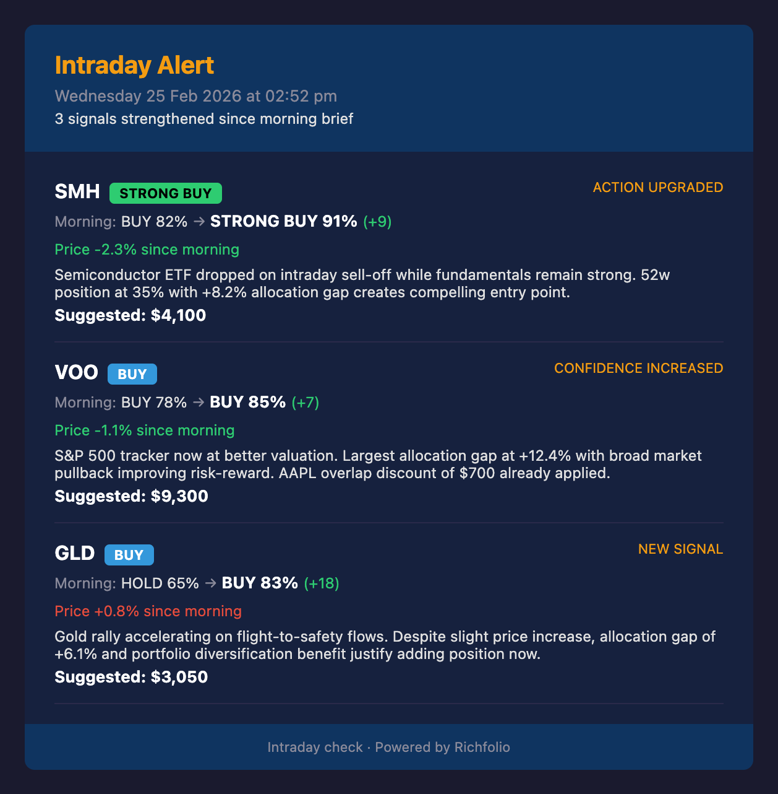

# Features

Richfolio packs 10 capabilities into a single pipeline — all running on free-tier APIs.

---

## AI Buy Recommendations

Gemini 2.5 Flash analyzes your entire portfolio context — valuation metrics, allocation gaps, news sentiment, risk indicators — and returns ranked buy recommendations with confidence scores and reasoning.

Each ticker gets an action: **STRONG BUY**, **BUY**, **HOLD**, or **WAIT**, along with a suggested dollar amount. If the Gemini API is unavailable or quota is exhausted, Richfolio falls back to gap-based recommendations automatically.

{: style="max-width: 400px; display: block; margin: 16px auto;" }

---

## Allocation Gap Analysis

Compares your current holdings against your target allocation percentages. Each ticker is scored by how far it is from its target, with suggested buy amounts in dollars and shares.

The analysis uses the higher of your actual portfolio value or configured estimate, so gap calculations remain meaningful even when your current holdings are smaller than your target portfolio size.

---

## Dynamic P/E Signals

Trailing P/E is compared against a historically-computed average P/E derived from Yahoo Finance's earnings history data. No manual benchmarks needed — the system fetches quarterly EPS data and computes the average automatically.

Tickers trading below their historical average P/E are flagged as **below avg** (potential value), while those above are flagged as **above avg** (potentially overvalued). ETFs and crypto naturally skip this signal since they have no earnings data.

---

## ETF Overlap Detection

When you hold individual stocks that are also top holdings of ETFs in your target portfolio, Richfolio detects the overlap and reduces the ETF's buy priority accordingly.

**Example:** If you hold 30 shares of AAPL and VOO contains ~7% AAPL, your direct AAPL exposure partially covers VOO's allocation gap. The suggested buy amount for VOO is reduced by the overlap value.

This prevents you from inadvertently over-concentrating in stocks you already hold through ETFs.

---

## 52-Week Range Signals

Each ticker's current price is positioned within its 52-week range (0% = at the low, 100% = at the high):

- **Near low** (below 20%) — potential buying opportunity
- **Near high** (above 80%) — exercise caution
- **Mid-range** — neutral

The AI analysis factors this into its recommendations alongside P/E and allocation data.

---

## News Digest

Top headlines per ticker from NewsAPI, fetched via batched requests to stay within the free tier's 100 requests/day limit. Headlines from the last 24 hours are matched to tickers using company name mapping.

News sentiment feeds into the AI analysis — negative news might signal a contrarian buying opportunity or genuine risk, depending on context.

---

## Portfolio Health

Two portfolio-wide metrics calculated from your current holdings:

- **Weighted Beta** — portfolio-level market risk, weighted by position size
- **Estimated Annual Dividend Income** — projected yearly dividends based on current yields and position sizes

---

## Intraday Alerts

Don't miss the buying moment of the day. After the morning brief runs, Richfolio saves the AI recommendations as a baseline. Intraday checks (`npm run intraday`) run every 2 hours during market hours, re-fetch prices, re-run Gemini analysis (skipping news to save API quota), and compare against the morning baseline.

An alert fires only when:

- **Confidence increases** by at least 5 percentage points (configurable) AND is above 80% (configurable)
- **Action upgrades** — e.g., BUY in the morning becomes STRONG BUY in the afternoon
- **New signal** — a ticker that wasn't recommended in the morning now has a strong buy signal

Alerts are delivered via email and Telegram with a focused format showing the morning vs current comparison, price change, and AI reasoning. No alert = no message — you only hear from Richfolio when it matters.

All thresholds are configurable via the `intradayAlerts` section in `config.json`. See [Configuration](configuration) for details.

{: style="max-width: 400px; display: block; margin: 16px auto;" }

---

## Weekly Rebalancing Report

A separate weekly report (`npm run weekly`) focused purely on portfolio drift and rebalancing actions. No news, no AI — just a clean table showing:

- **BUY** — underweight positions (gap > 1%)
- **TRIM** — overweight positions (gap < -1%)
- **OK** — positions within target range

Includes overweight warnings and flags holdings that aren't in your target portfolio.

{: style="max-width: 400px; display: block; margin: 16px auto;" }

---

## Dual Delivery

Every report is delivered through two channels:

- **Email** — dark-themed HTML email via Resend with full detail (allocation table, P/E signals, AI recommendations, news)
- **Telegram** — condensed plain-text summary via Telegram Bot API, optimized for mobile reading

Both channels work independently — if one isn't configured, the other still delivers.
