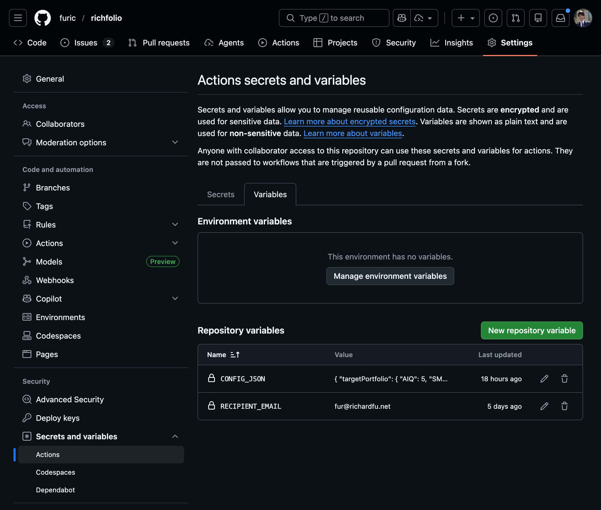
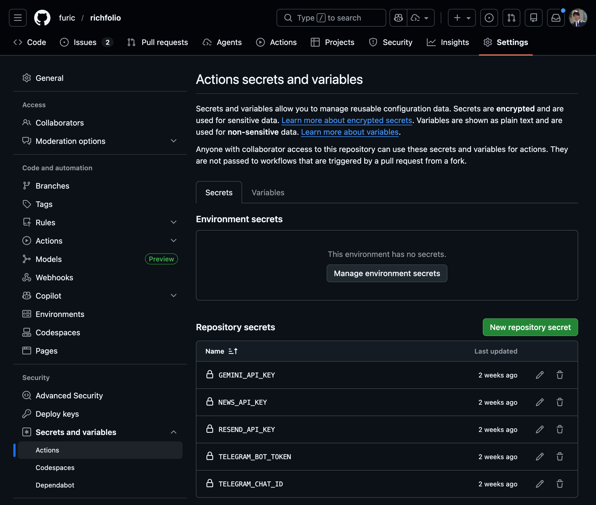

# Getting Started

Get Richfolio running in under 5 minutes — no coding required.

---

## 1. Fork the Repo

[Fork Richfolio on GitHub](https://github.com/furic/richfolio/fork){: .btn .btn-primary }

This creates your own copy where you can configure your portfolio and run automated daily briefs via GitHub Actions.

---

## 2. Configure Your Portfolio

Set up your target allocations and current holdings in GitHub. See [Configuration](configuration) for the full field reference.

{: style="max-width: 500px; display: block; margin: 16px auto;" }

---

## 3. Add API Keys

Add your API keys as GitHub Secrets. At minimum you need `RESEND_API_KEY`. See [API Keys](api-keys) for step-by-step instructions for each service.

{: style="max-width: 500px; display: block; margin: 16px auto;" }

---

## 4. Deploy

Enable GitHub Actions to receive automated daily briefs, intraday alerts, and weekly reports. See [Deployment](deployment) for setup details.

---

## What's Next

- [Configuration](configuration) — customize your portfolio allocations
- [API Keys](api-keys) — set up Resend, NewsAPI, Gemini, and Telegram
- [Deployment](deployment) — automate with GitHub Actions
- [Local Development](local-development) — run locally or contribute
