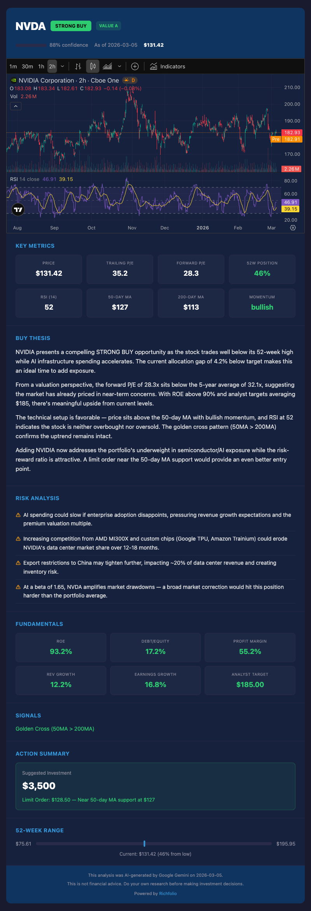

# How It Works

Richfolio is a single-pipeline system — no API server, no database, no dashboard. It runs once, produces a report, and exits.

---

## Data Pipeline

```
CONFIG_JSON variable + GitHub Secrets
  → fetchPrices (Yahoo Finance: prices, P/E, 52w range, beta, dividends, ETF holdings, fundamentals, earnings calendar)
  → fetchTechnicals (Yahoo Finance chart: SMA50, SMA200, RSI, MACD, Bollinger Bands, ATR, Stochastic, OBV, momentum)
  → fetchNews (NewsAPI: top headlines per ticker + Gemini sentiment scoring)
  → analyze (allocation gaps, P/E signals, overlap discounts, portfolio metrics)
  → aiAnalyze (Gemini two-stage Think/Plan: Stage 1 Observe → Stage 2 Decide + reasoning history)
  → guards (post-AI validation: earnings guard, STRONG BUY criteria, bond cap, confidence/value sanity)
  → email + telegram (deliver daily brief with value ratings, bottom signals, technicals, earnings badges)
```

Weekly mode (`--weekly`) skips news, technicals, and AI, producing a focused rebalancing report.

Intraday mode (`--intraday`) re-fetches prices and technicals, re-runs AI (skipping news), compares against the morning baseline, and alerts only when signals strengthen.

---

## Architecture

```
src/
├── config.ts          # Typed loader for CONFIG_JSON variable + GitHub Secrets
├── index.ts           # Entry point — parses --weekly/--intraday flags, wires modules
├── fetchPrices.ts     # Yahoo Finance via yahoo-finance2 (instance-based v3 API) + fundamentals + earnings calendar
├── fetchTechnicals.ts # Yahoo Finance chart: SMA50, SMA200, RSI, MACD, Bollinger Bands, ATR, Stochastic, OBV
├── fetchNews.ts       # NewsAPI with ticker-to-company-name mapping + Gemini sentiment scoring
├── analyze.ts         # Core analysis: gaps, P/E signals, overlap, portfolio metrics
├── aiAnalysis.ts      # Two-stage Gemini Think/Plan prompt builder + JSON response parser + retry logic
├── guards.ts          # Post-AI validation pipeline: 6 sequential safety checks
├── detailedAnalysis.ts# Gemini 2.5 Flash: detailed buy thesis + risk analysis for STRONG BUY tickers
├── analysisUrl.ts     # Compress analysis data into URL hash for the GitHub Pages analysis page
├── state.ts           # Morning baseline save/load for intraday comparison + 7-day reasoning history
├── intradayCompare.ts # Compare current AI recs vs morning baseline
├── email.ts           # Daily HTML email template + Resend delivery
├── intradayEmail.ts   # Intraday alert email template + Resend delivery
├── weeklyEmail.ts     # Weekly rebalancing email template + Resend delivery
└── telegram.ts        # Telegram Bot API delivery (daily + intraday + weekly formatters)
```

Each module is independent — they communicate through typed interfaces (`QuoteData`, `TechnicalData`, `AllocationItem`, `AllocationReport`, `AIBuyRecommendation`, `IntradayAlert`, `TickerObservation`). `QuoteData` includes fundamental data (ROE, debt/equity, FCF, margins, growth) from Yahoo's `financialData` module, plus earnings calendar data (next earnings date, days to earnings). `TechnicalData` includes MACD (crossover + histogram), Bollinger Bands (%B, bandwidth, squeeze), ATR (volatility), Stochastic (%K/%D), OBV trend (accumulation/distribution), and volume change (7d vs 30d) for bottom-fishing detection. `TickerObservation` is the intermediate output from the Think stage, containing structured signals, risk flags, and summaries.

---

## Analysis Logic

### Allocation Gaps

For each ticker in your target portfolio:

1. **Current value** = shares held × current price
2. **Current %** = current value / portfolio value × 100
3. **Gap %** = target % − current %
4. **Suggested buy** = gap % × portfolio value (only when underweight)

Portfolio value uses the higher of actual holdings value or configured `totalPortfolioValueUSD`.

### Dynamic P/E Signals

Yahoo Finance provides quarterly EPS data via `earningsHistory`. Richfolio computes:

1. Filter positive quarterly EPS values (need at least 2 quarters)
2. Average quarterly EPS → annualize (× 4)
3. **Average P/E** = current price / annualized EPS
4. Compare trailing P/E against this average:
   - **Below average** → potential value opportunity
   - **Above average** → potentially overvalued

ETFs and crypto skip this signal (no earnings data).

### ETF Overlap Detection

For each target ETF, Yahoo Finance returns its top ~10 holdings with weight percentages. Richfolio checks if you hold any of those stocks directly:

1. For each ETF holding that matches a stock in `currentHoldings`:
   - **ETF exposure** = holding weight × ETF's suggested buy value
   - **Your exposure** = shares held × stock price
   - **Overlap** = min(ETF exposure, your exposure)
2. Sum all overlaps for the ETF
3. Reduce the ETF's suggested buy value by the total overlap

**Example:** VOO contains ~7% AAPL. If you hold $8,000 in AAPL and VOO's suggested buy is $10,000, the AAPL overlap is min(7% × $10,000, $8,000) = $700. VOO's buy suggestion drops to $9,300.

### 52-Week Range Scoring

Each ticker's price is positioned within its 52-week range:

- **0–20%** → near 52-week low (buying opportunity signal)
- **20–80%** → mid-range (neutral)
- **80–100%** → near 52-week high (caution signal)

### Technical Indicators

Richfolio fetches ~250 days of daily OHLCV data via `yahooFinance.chart()` and computes:

1. **SMA50** — simple moving average of the last 50 closing prices
2. **SMA200** — simple moving average of the last 200 closing prices (null if < 200 data points)
3. **RSI(14)** — standard Relative Strength Index using 14-day average gain/loss
4. **MACD** — EMA(12) − EMA(26), with signal line = EMA(9) of MACD line. Reports the histogram (MACD − signal, positive = bullish momentum) and detects bullish/bearish crossovers from the last 2 trading days. Requires 35+ data points. Best for confirming trend direction
5. **Bollinger Bands** — SMA(20) ± 2 standard deviations. Reports %B (0 = at lower band, 1 = at upper band), bandwidth (volatility measure), and squeeze detection (bandwidth in bottom 20% of 120-day range, signaling an imminent breakout). Requires 20+ data points. Best for range-bound markets
6. **Momentum signal**:
   - **Bullish** — price > SMA50, SMA50 > SMA200, RSI > 40
   - **Bearish** — price < SMA50, SMA50 < SMA200, RSI < 60
   - **Neutral** — mixed signals
7. **ATR(14)** — Average True Range with Wilder's smoothing. Reports absolute value and % of price. ATR% > 3% = high volatility (widen limit orders), ATR% < 1% = low volatility (tighter limits). Requires 15+ data points
8. **Stochastic Oscillator** — %K(14) with %D(3) SMA smoothing. %K < 20 = oversold confirmation (added to momentum signals for STRONG BUY criteria), %K > 80 = overbought. Requires 16+ data points
9. **OBV trend** — On-Balance Volume with 10-day linear regression slope normalized by average volume. Reports direction: rising (accumulation), falling (distribution), or flat. Absolute OBV is meaningless across tickers. Requires 11+ data points
10. **Golden/Death cross** — SMA50 crossing above (golden) or below (death) SMA200
11. **Recent lows** — minimum price in last 7 and 30 trading days (support levels)
12. **Volume change** — 7-day average volume vs prior 30-day average (used by the bottom-fishing model to detect selling exhaustion)

Tickers with fewer than 50 data points are gracefully skipped. All indicators are computed from existing chart data — zero extra API calls.

### AI Scoring (Two-Stage Think/Plan)

Richfolio uses a two-stage AI framework inspired by [OpenAlice](https://github.com/TraderAlice/OpenAlice)'s cognitive architecture:

**Stage 1 — Observe (Think):** The Gemini prompt receives all data points per ticker — price, P/E ratios, 52-week position, allocation gap, dividend yield, beta, ETF overlap, technical indicators (MAs, RSI, MACD, Bollinger Bands, ATR, Stochastic, OBV, momentum, volume change), fundamental data (ROE, debt/equity, FCF, margins, growth, analyst targets), earnings calendar, macro environment, and recent news headlines with sentiment scores. The AI extracts structured observations: which price-level signals are present, which momentum signals are active, risk flags, summaries, and news sentiment. No action recommendations at this stage.

**Stage 2 — Decide (Plan):** A separate Gemini call receives the structured observations from Stage 1, the decision rules, gap amounts, macro context, and 7-day reasoning history. Because it works with pre-digested observations (not raw numbers), it applies the STRONG BUY criteria more consistently. The AI returns:

- **Action**: STRONG BUY, BUY, HOLD, or WAIT
- **Confidence**: 0–100%
- **Reason**: 1–2 sentence explanation
- **Suggested amount**: USD to invest
- **Limit order price**: suggested price below market based on nearest support (MAs, recent lows, round numbers)
- **Limit price reason**: 1 sentence explaining the support level
- **Value rating**: A/B/C/D for individual stocks (empty for ETFs and crypto)
- **Bottom signal**: oversold/accumulation zone description (empty if no indicators present)

#### Value Investing Framework (Stocks Only)

The AI rates each individual stock A–D based on five fundamental criteria: ROE > 15%, debt/equity < 50%, FCF/operating CF > 80%, positive earnings growth, and price below analyst target. The rating adjusts the AI's confidence score (A boosts ~10 points, D reduces ~10 points). Fundamental data comes from Yahoo's `financialData` module — added to the existing `quoteSummary` call with zero extra API overhead.

#### Bottom-Fishing Model (All Tickers)

The AI evaluates four bottom indicators for every ticker (stocks, ETFs, and crypto): RSI < 30, volume contraction > 20%, price below 200-day MA, and death cross. Crypto triggers a bottom signal at 2+ indicators; stocks and ETFs require 3+ (stricter threshold to avoid false signals from single dips). Volume change is computed from existing chart data — no additional API calls.

Technical indicators further refine the AI's confidence — a bullish momentum signal with oversold RSI strengthens a buy case, while bearish signals or overbought RSI weaken it. The AI follows an explicit **indicator conflict resolution hierarchy**: MACD is trusted in trending markets, Bollinger Bands in range-bound markets. When both agree (e.g., bullish MACD crossover + bounce off lower Bollinger Band), confidence is boosted 5–10 points. A Bollinger Squeeze with a simultaneous MACD crossover is treated as the strongest entry signal (confidence boost 10–15 points). When they disagree (e.g., bullish MACD but %B near upper band), confidence is reduced to avoid overextended entries.

After the AI returns recommendations, the **guard validation pipeline** (`guards.ts`) runs 6 sequential checks: bond ETF cap, earnings proximity, STRONG BUY criteria enforcement, max 2 STRONG BUY, confidence sanity, and buy value sanity. Guards catch cases where the AI ignores prompt instructions and serve as a programmatic safety net.

If Gemini is unavailable, the system falls back to gap-based ranking (largest allocation gap first). Transient Gemini errors (503/429) are automatically retried up to 2 times with 5s/10s backoff before falling back.

### Detailed Analysis Page (STRONG BUY Only)

For each **STRONG BUY** ticker, a separate Gemini 2.5 Flash call generates an in-depth buy thesis (3–4 paragraphs) and 3–4 specific risk factors. This detailed analysis, along with all metrics and technical data, is compressed using zlib and encoded as a base64url URL hash fragment.

The email and Telegram messages include a **"More Details"** link pointing to a static analysis page hosted on GitHub Pages (`docs/analysis/index.html`). The page decodes the URL hash client-side using pako and renders:

- **Interactive TradingView chart** — 6-month candlestick with SMA50, SMA200, and RSI overlays
- **Key metrics grid** — price, P/E, 52-week position, RSI, moving averages, momentum
- **Buy thesis** — multi-paragraph detailed analysis from Gemini Flash
- **Risk analysis** — specific risk factors to watch
- **Fundamentals** — ROE, debt/equity, margins, growth, analyst target (stocks only)
- **Signals** — golden/death cross, bottom signals (crypto)
- **Action summary** — suggested investment amount, limit order price with reasoning
- **52-week range bar** — visual position within the yearly range

No server-side logic is needed — all data is embedded in the URL. The page works offline once loaded. The URL is typically ~1,000–1,500 characters, well within email client limits.

{: style="max-width: 500px; display: block; margin: 16px auto;" }

---

## Three Modes

| | Daily | Intraday | Weekly |
|---|---|---|---|
| Prices & fundamentals | Yes | Yes | Yes |
| Technical indicators | Yes | Yes | No |
| News headlines | Yes | No | No |
| AI recommendations | Yes | Yes | No |
| Limit order prices | Yes | Yes | No |
| Value ratings (stocks) | Yes | Yes | No |
| Bottom signals (crypto) | Yes | Yes | No |
| Allocation analysis | Yes | Yes | Yes |
| Baseline comparison | Saves baseline | Compares vs morning | No |
| Email template | Full brief | Alert (triggered only) | Rebalancing table |
| Telegram format | AI recs + news | Alert (triggered only) | BUY/TRIM actions |

{: style="max-width: 260px; display: inline-block;" }
{: style="max-width: 260px; display: inline-block;" }
{: style="max-width: 260px; display: inline-block;" }
