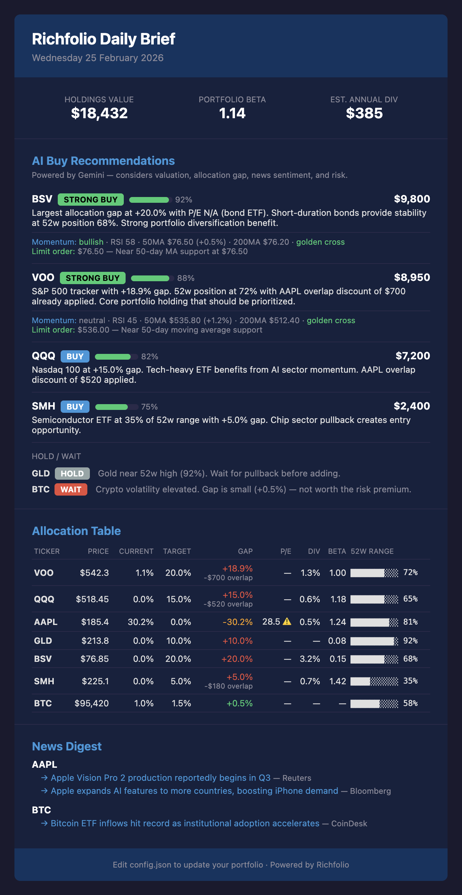
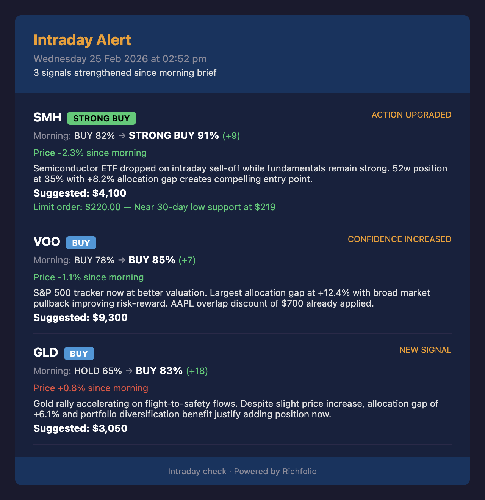
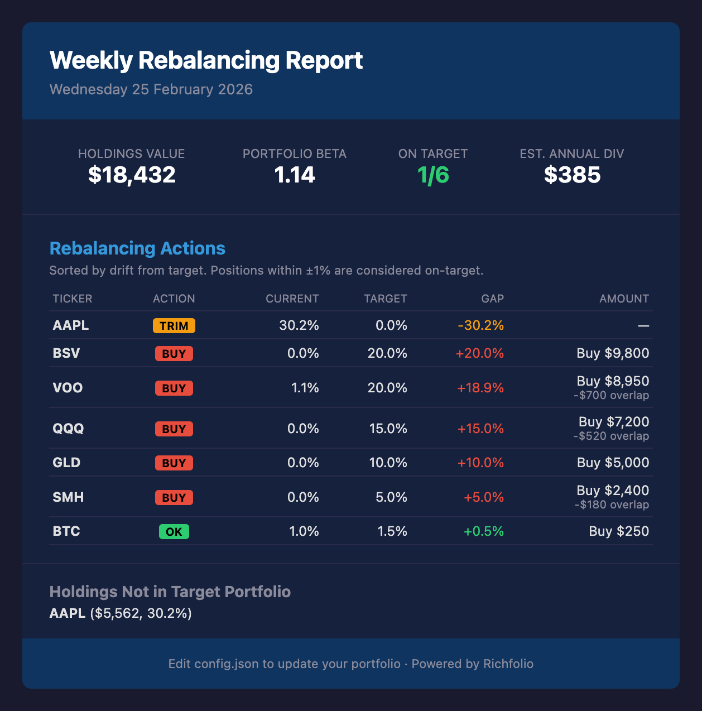

# How It Works

Richfolio is a single-pipeline system — no API server, no database, no dashboard. It runs once, produces a report, and exits.

---

## Data Pipeline

```
config.json + .env
  → fetchPrices (Yahoo Finance: prices, P/E, 52w range, beta, dividends, ETF holdings)
  → fetchTechnicals (Yahoo Finance chart: SMA50, SMA200, RSI, momentum signals)
  → fetchNews (NewsAPI: top headlines per ticker)
  → analyze (allocation gaps, P/E signals, overlap discounts, portfolio metrics)
  → aiAnalyze (Gemini: AI buy recommendations + confidence scores + limit order prices)
  → email + telegram (deliver daily brief with technical insights for STRONG BUY)
```

Weekly mode (`--weekly`) skips news, technicals, and AI, producing a focused rebalancing report.

Intraday mode (`--intraday`) re-fetches prices and technicals, re-runs AI (skipping news), compares against the morning baseline, and alerts only when signals strengthen.

---

## Architecture

```
src/
├── config.ts          # Typed loader for config.json + .env
├── index.ts           # Entry point — parses --weekly/--intraday flags, wires modules
├── fetchPrices.ts     # Yahoo Finance via yahoo-finance2 (instance-based v3 API)
├── fetchTechnicals.ts # Yahoo Finance chart: SMA50, SMA200, RSI, momentum signals
├── fetchNews.ts       # NewsAPI with ticker-to-company-name mapping
├── analyze.ts         # Core analysis: gaps, P/E signals, overlap, portfolio metrics
├── aiAnalysis.ts      # Gemini prompt builder + JSON response parser + limit order prices
├── state.ts           # Morning baseline save/load for intraday comparison
├── intradayCompare.ts # Compare current AI recs vs morning baseline
├── email.ts           # Daily HTML email template + Resend delivery
├── intradayEmail.ts   # Intraday alert email template + Resend delivery
├── weeklyEmail.ts     # Weekly rebalancing email template + Resend delivery
└── telegram.ts        # Telegram Bot API delivery (daily + intraday + weekly formatters)
```

Each module is independent — they communicate through typed interfaces (`QuoteData`, `TechnicalData`, `AllocationItem`, `AllocationReport`, `AIBuyRecommendation`, `IntradayAlert`).

---

## Analysis Logic

### Allocation Gaps

For each ticker in your target portfolio:

1. **Current value** = shares held × current price
2. **Current %** = current value / portfolio value × 100
3. **Gap %** = target % − current %
4. **Suggested buy** = gap % × portfolio value (only when underweight)

Portfolio value uses the higher of actual holdings value or configured `totalPortfolioValueUSD`.

### Dynamic P/E Signals

Yahoo Finance provides quarterly EPS data via `earningsHistory`. Richfolio computes:

1. Filter positive quarterly EPS values (need at least 2 quarters)
2. Average quarterly EPS → annualize (× 4)
3. **Average P/E** = current price / annualized EPS
4. Compare trailing P/E against this average:
   - **Below average** → potential value opportunity
   - **Above average** → potentially overvalued

ETFs and crypto skip this signal (no earnings data).

### ETF Overlap Detection

For each target ETF, Yahoo Finance returns its top ~10 holdings with weight percentages. Richfolio checks if you hold any of those stocks directly:

1. For each ETF holding that matches a stock in `currentHoldings`:
   - **ETF exposure** = holding weight × ETF's suggested buy value
   - **Your exposure** = shares held × stock price
   - **Overlap** = min(ETF exposure, your exposure)
2. Sum all overlaps for the ETF
3. Reduce the ETF's suggested buy value by the total overlap

**Example:** VOO contains ~7% AAPL. If you hold $8,000 in AAPL and VOO's suggested buy is $10,000, the AAPL overlap is min(7% × $10,000, $8,000) = $700. VOO's buy suggestion drops to $9,300.

### 52-Week Range Scoring

Each ticker's price is positioned within its 52-week range:

- **0–20%** → near 52-week low (buying opportunity signal)
- **20–80%** → mid-range (neutral)
- **80–100%** → near 52-week high (caution signal)

### Technical Indicators

Richfolio fetches ~250 days of daily OHLCV data via `yahooFinance.chart()` and computes:

1. **SMA50** — simple moving average of the last 50 closing prices
2. **SMA200** — simple moving average of the last 200 closing prices (null if < 200 data points)
3. **RSI(14)** — standard Relative Strength Index using 14-day average gain/loss
4. **Momentum signal**:
   - **Bullish** — price > SMA50, SMA50 > SMA200, RSI > 40
   - **Bearish** — price < SMA50, SMA50 < SMA200, RSI < 60
   - **Neutral** — mixed signals
5. **Golden/Death cross** — SMA50 crossing above (golden) or below (death) SMA200
6. **Recent lows** — minimum price in last 7 and 30 trading days (support levels)

Tickers with fewer than 50 data points are gracefully skipped.

### AI Scoring

The Gemini prompt includes all data points per ticker: price, P/E ratios, 52-week position, allocation gap, dividend yield, beta, ETF overlap, technical indicators (MAs, RSI, momentum), and recent news headlines. The AI weighs these holistically and returns:

- **Action**: STRONG BUY, BUY, HOLD, or WAIT
- **Confidence**: 0–100%
- **Reason**: 1–2 sentence explanation
- **Suggested amount**: USD to invest
- **Limit order price**: suggested price below market based on nearest support (MAs, recent lows, round numbers)
- **Limit price reason**: 1 sentence explaining the support level

Technical indicators refine the AI's confidence — a bullish momentum signal with oversold RSI strengthens a buy case, while bearish signals or overbought RSI weaken it. Limit order prices and technical details are displayed for **STRONG BUY** tickers in the email and Telegram output.

If Gemini is unavailable, the system falls back to gap-based ranking (largest allocation gap first).

---

## Three Modes

| | Daily | Intraday | Weekly |
|---|---|---|---|
| Prices & fundamentals | Yes | Yes | Yes |
| Technical indicators | Yes | Yes | No |
| News headlines | Yes | No | No |
| AI recommendations | Yes | Yes | No |
| Limit order prices | Yes | Yes | No |
| Allocation analysis | Yes | Yes | Yes |
| Baseline comparison | Saves baseline | Compares vs morning | No |
| Email template | Full brief | Alert (triggered only) | Rebalancing table |
| Telegram format | AI recs + news | Alert (triggered only) | BUY/TRIM actions |

{: style="max-width: 260px; display: inline-block;" }
{: style="max-width: 260px; display: inline-block;" }
{: style="max-width: 260px; display: inline-block;" }
